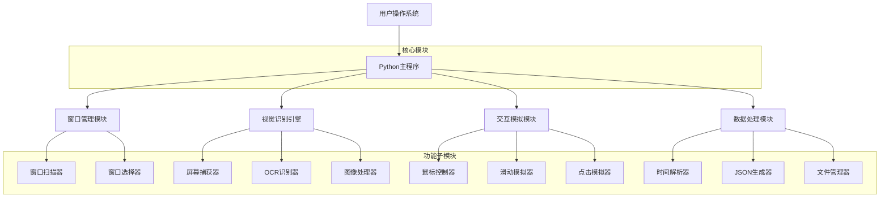

## 1. 架构设计



## 2. 技术栈描述

* **核心语言**: Python 3.8+

* **图像处理**: Pillow, OpenCV

* **OCR识别**: pytesseract + Tesseract-OCR

* **窗口管理**: pywin32, win32gui

* **鼠标控制**: pyautogui

* **数据存储**: json, pathlib

* **日志系统**: logging

## 3. 核心模块设计

### 3.1 窗口管理模块

负责扫描和选择目标窗口，适配不同尺寸的应用程序。

**主要功能**:

* 扫描所有打开的窗口程序

* 识别浏览器和Android模拟器窗口

* 提供交互式窗口选择界面

* 自适应窗口尺寸变化

### 3.2 视觉识别引擎

基于OCR技术识别屏幕上的文字内容，提取帖子信息。

**技术实现**:

* 使用Tesseract OCR引擎进行中文文字识别

* OpenCV进行图像预处理和区域分割

* Pillow进行图像格式转换和优化

* 智能识别帖子卡片边界和文字区域

### 3.3 交互模拟模块

模拟真实用户的鼠标操作，实现滑动和点击功能。

**核心算法**:

* 贝塞尔曲线生成自然滑动轨迹

* 随机时间间隔模拟人工操作节奏

* 多点点击模拟真实触摸操作

* 滑动速度和距离的自适应调整

### 3.4 数据处理模块

解析提取的内容并格式化为JSON数据。

**处理流程**:

* 相对时间解析（如"2小时前"→绝对时间）

* 内容清洗和格式化

* JSON结构化存储

* 文件命名规范化

## 4. 数据结构设计

### 4.1 帖子数据结构

```json
{
    "title": "帖子标题",
    "author": "作者昵称",
    "publish_time": "2026-01-29 14:30:00",
    "content": "帖子正文内容",
    "images_text": ["图片1文字", "图片2文字"],
    "keywords_matched": ["关键词1", "关键词2"],
    "scraped_at": "2026-01-29 16:00:00",
    "source_type": "web|emulator"
}
```

### 4.2 配置文件结构

```json
{
    "keywords": ["美妆", "护肤", "穿搭"],
    "scroll_config": {
        "speed_range": [0.5, 1.5],
        "pause_range": [1.0, 3.0]
    },
    "ocr_config": {
        "language": "chi_sim",
        "psm": 6
    },
    "output_config": {
        "folder": "result",
        "filename_pattern": "{keyword}_{timestamp}"
    }
}
```

## 5. 异常处理机制

### 5.1 窗口相关异常

* 窗口关闭：重新扫描可用窗口

* 窗口尺寸变化：动态调整捕获区域

* 窗口最小化：自动恢复窗口状态

### 5.2 OCR识别异常

* 识别失败：图像预处理后重试

* 文字区域检测失败：调整检测参数

* 中文识别率低：切换语言模型

### 5.3 交互模拟异常

* 点击无响应：调整点击坐标和延迟

* 滑动被检测：改变滑动轨迹和速度

* 界面加载超时：增加等待时间

## 6. 性能优化策略

### 6.1 图像处理优化

* 区域截图替代全屏捕获

* 图像压缩减少处理时间

* 缓存机制避免重复识别

### 6.2 OCR性能优化

* 多线程并行处理

* 图像预处理提升识别率

* 区域限定减少识别范围

### 6.3 内存管理

* 及时释放大图像对象

* 循环引用处理

* 日志轮转防止文件过大

## 7. 安全与反检测

### 7.1 反检测机制

* 随机化操作间隔时间

* 模拟真实用户行为轨迹

* 避免固定模式和规律

### 7.2 异常监控

* 操作成功率监控

* 异常行为检测

* 自动调整操作策略

## 8. 扩展性设计

### 8.1 模块化架构

* 各功能模块独立，便于维护和扩展

* 插件化设计支持新功能添加

* 配置驱动，减少代码修改

### 8.2 多平台支持

* 架构设计预留其他平台接口

* 操作系统适配层抽象

* 统一的操作接口定义

