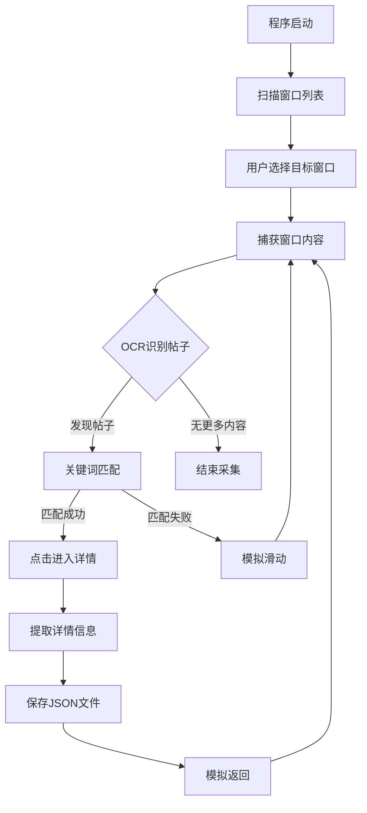

## 1. 产品概述
小红书视觉自动化爬虫工具，通过屏幕捕获和OCR技术实现内容抓取。用户无需考虑登录问题，工具会自动识别已打开的浏览器或模拟器窗口，模拟人工滑动操作进行内容采集。

解决手动收集小红书内容的效率问题，适用于个人用户快速获取特定关键词的帖子信息。

## 2. 核心功能

### 2.1 用户角色
本产品为个人使用工具，无需用户系统，单用户操作。

### 2.2 功能模块
核心功能包括：
1. **窗口选择器**：扫描并列出所有打开的窗口，支持选择浏览器或模拟器
2. **视觉识别引擎**：OCR识别帖子标题和首图文字
3. **关键词匹配**：根据设定关键词筛选目标帖子
4. **内容提取器**：进入帖子详情页提取完整信息
5. **数据存储**：JSON格式保存到result文件夹

### 2.3 功能详情
| 功能模块 | 子模块 | 功能描述 |
|---------|--------|----------|
| 窗口管理 | 窗口扫描 | 自动检测所有打开的窗口程序，识别浏览器和模拟器窗口 |
| 窗口管理 | 窗口选择 | 用户交互式选择目标窗口，支持窗口尺寸自适应 |
| 视觉识别 | 屏幕捕获 | 实时捕获选定窗口的屏幕内容 |
| 视觉识别 | OCR文字识别 | 识别帖子标题、图片中的文字内容 |
| 内容筛选 | 关键词匹配 | 根据标题+首图文字进行关键词匹配 |
| 交互模拟 | 滑动操作 | 模拟手指滑动，支持不同速度的滑动操作 |
| 交互模拟 | 点击操作 | 模拟点击帖子进入详情页 |
| 数据提取 | 详情页解析 | 提取帖子标题、作者、发布时间、图片文字 |
| 数据提取 | 时间处理 | 将相对时间（如2小时前）转换为绝对日期 |
| 数据存储 | JSON导出 | 按帖子分别保存为JSON文件到result文件夹 |

## 3. 核心流程

### 主流程描述
1. **启动阶段**：程序启动后扫描所有打开的窗口，用户选择目标小红书窗口（浏览器手机版或模拟器）
2. **内容发现**：从当前位置开始，OCR识别可见区域的帖子标题和首图文字
3. **关键词匹配**：检查是否包含目标关键词，匹配成功则点击进入
4. **详情提取**：进入帖子详情页，向下滑动获取完整内容，提取所有信息
5. **数据保存**：将提取的信息整理为JSON格式，保存到result文件夹
6. **返回继续**：模拟返回操作回到列表页，继续下一个帖子的识别

### 异常处理
- 窗口尺寸变化时自动适配捕获区域
- OCR识别失败时重试机制
- 滑动操作被检测到时调整滑动参数

## 4. 技术特性

### 4.1 视觉识别
- 支持中文OCR，准确识别帖子标题和图片文字
- 自适应不同分辨率的窗口捕获
- 智能区域识别，区分帖子卡片边界

### 4.2 交互模拟
- 模拟真实用户滑动轨迹，避免被检测
- 支持变速滑动，模拟人工操作习惯
- 精确的点击坐标计算，适配不同界面布局

### 4.3 数据处理
- 智能时间解析，支持多种相对时间格式
- JSON结构化存储，便于后续数据分析
- 文件名包含关键词和时间戳，方便管理

### 4.4 兼容性
- 支持Windows系统下各种浏览器手机版
- 兼容主流Android模拟器（雷电、MuMu等）
-